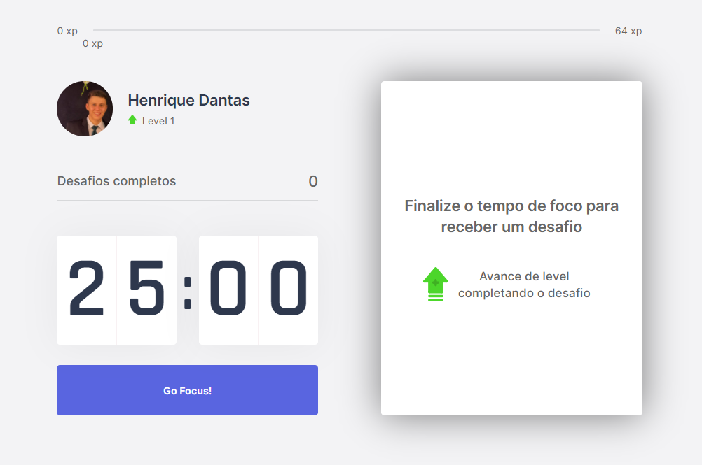

<h1 align="center">
{ Focus Challenger }
</h1>

  <a href="#-tecnologias">Tecnologias</a>&nbsp;&nbsp;&nbsp;|&nbsp;&nbsp;&nbsp;
  <a href="#-projeto">Projeto</a>&nbsp;&nbsp;&nbsp;|&nbsp;&nbsp;&nbsp;
  <a href="#-layout">Layout</a>&nbsp;&nbsp;&nbsp;|&nbsp;&nbsp;&nbsp;

 

  

## 🚀 Tecnologias

Esse projeto foi desenvolvido utilizando:
- Next.js
- TypeScript
- CSS3
- React.js

## 💻 Projeto

O focus challenger é uma aplicação baseada no conceito de pomodoro a qual o individuo mantém um foco total durante 25 minutos e depois realiza alguma outra atividade além do que está mantendo o foco. Essa aplicação traz desafios após os minutos e ao completa-los o usuário é recompensado com uma quantidade de experiência para subir de level.

## 🔖 Layout 

Você pode visualizar o layout do projeto através [desse link](https://www.figma.com/file/Ody4oau0GM5k5oPDCqLEIP/Move.it-1.0-(Copy)?node-id=160%3A2761). É necessário ter conta no [Figma](https://figma.com) para acessá-lo.

